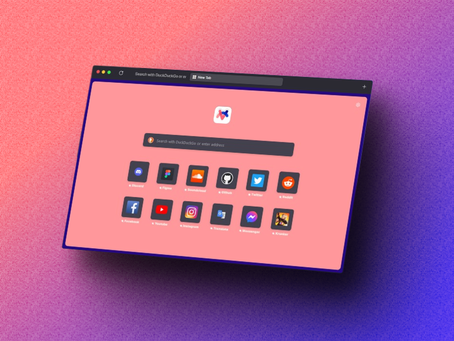

  
  

   
  

  <h1 align="center"><b>ViceFox | Coming soon!</b></h1>
  

  Don't ask why it's called "ViceFox"
     
    <a href="https://github.com/jtlw99/vicefox/releases"><strong>Install (Coming soon!) »</strong></a>
     
  

 <h1 align="center"><b>What is ViceFox?</b></h1>
  

   
  

  

  ViceFox is a theme that make your boring FireFox not boring anymore!
  

<h1 align="center"><b>Installation</b></h1>
  

    To install ViceFox Theme you need to open your Firefox configurations and turn style modification on. To do that please follow these steps:
  

- Digit `about:config` on firefox address bar and click enter.
- On the search bar, search for `toolkit.legacyUserProfileCustomizations.stylesheets` and set the value to `true`.
- Open `about:support` and click on the “Open Folder” button on the right of "Profile Folder" to open it.
- When the folder opens, drop the `chrome` folder that you find on the <a href="https://github.com/jtlw99/vicefox/releases">releases.</a>
- Restart firefox.

 <h1 align="center"><b>Support</b></h1>

  

    If you have any problems you can open a issue on this repository!
  

 <h1 align="center"><b>Special thanks</b></h1>

- The ArcFox Team
- denizjcan
- JT Studio

