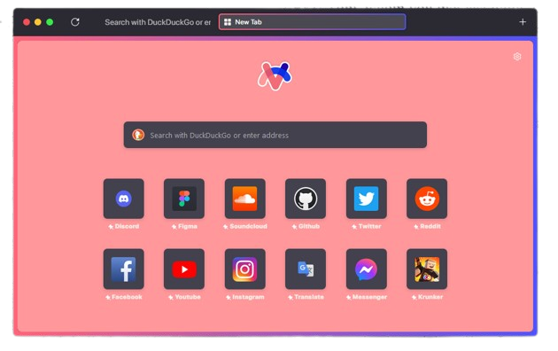

  
  

   
  

  <h1 align="center"><b>ViceFox</b></h1>
  

  Don't ask why it's called ViceFox
     
    <a href="https://github.com/jtlw99/vicefox/releases"><strong>Install (Coming soon!) »</strong></a>
     
  

# What is ArcFox?
  

   
  

ArcFox is a pack of firefox improvements that brings the appearance and some of the features of arc browser to firefox. Recently, The Browser Company © (the developers of arc browser) announced a windows version, so this project almost lost the reason to exist. But there still a linux version to be made and some people just like firefox and don't want to change.

I really recomend you to give a try on arc browser if you can. But we gonna do our best to make firefox nice as arc.

### ViceFox -Theme Installation
To install arcfox-theme you need to open your Firefox configurations and turn style modification on. To do that please follow this steps:

- Digit <a href="about:config">"about:config"</a> on firefox address bar and click enter.
- On the search bar, search for "toolkit.legacyUserProfileCustomizations.stylesheets" and set the value to "true".
- Open <a href="about:support">"about:support"</a> and click on the “Open Folder” button on the right of "Profile Folder" to open it.
- When the folder opens, search for a folder called "chrome", if you don't find it create one.
- Inside the "chrome" folder, drop the "userChrome.css" that you find on the <a href="https://github.com/use-arcrcfox/releases">releases.</a>
- Restart firefox.

# Support
If you have any problems you can open a issue on this repository!

